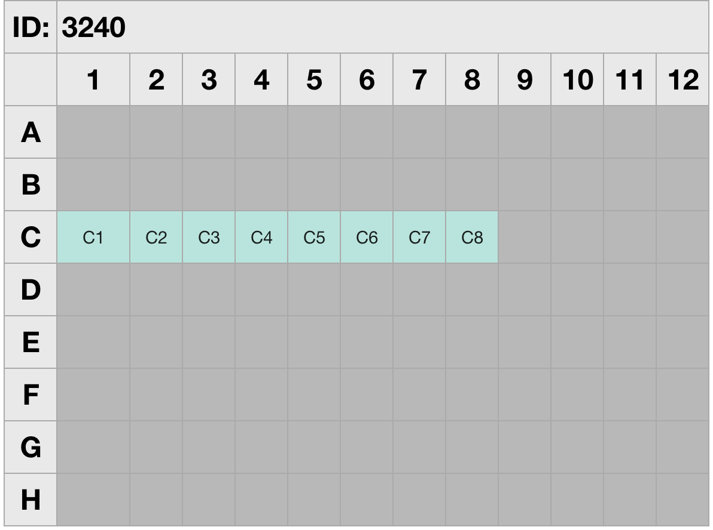
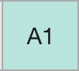

# Collection Management

The Collection Management libraries were developed to standardize how code interacts with collections.  Although not exhaustive these libraries do cover a majority of the different ways that collections may be used.  These libraries can be somewhat subtle, it is recommended to review the entirety of the libraries prior to extensive use.

---

## Dependencies
- [**Standard Libs**](https://github.com/aquariumbio/protocol-base/tree/main/standard_libs)

    - [ItemActions](https://github.com/aquariumbio/protocol-base/tree/main/standard_libs/libraries/itemactions)
    - [AssociationManagement](https://github.com/aquariumbio/protocol-base/tree/main/standard_libs/libraries/associationmanagement)
    - [PartProvenance](https://github.com/aquariumbio/protocol-base/tree/main/standard_libs/libraries/associationmanagement)
    - [Units](https://github.com/aquariumbio/protocol-base/tree/main/standard_libs/libraries/units)
- [**Small Instruments**](https://github.com/aquariumbio/protocol-base/tree/main/small_instruments)
    - [Pipettors](https://github.com/aquariumbio/protocol-base/tree/main/small_instruments/libraries/pipettors)

---
## Library Information

 ### [Collection Actions](https://github.com/aquariumbio/protocol-base/tree/main/collection_management/libraries/collectionactions)

The [Collection Actions](https://github.com/aquariumbio/protocol-base/tree/main/collection_management/libraries/collectionactions) library is frankly an extension of the [ItemActions](https://github.com/aquariumbio/protocol-base/tree/main/standard_libs/libraries/itemactions) library and should always be used along with [ItemActions](https://github.com/aquariumbio/protocol-base/tree/main/standard_libs/libraries/itemactions).  These libraries pertain to actions that typically affect the collection as a whole such as:

- Moving, Fetching, or Deleting
- Removing Supernatant
- Labeling or re-labeling
- Making new Collections

&nbsp;

### [Collection Data](https://github.com/aquariumbio/protocol-base/tree/main/collection_management/libraries/collectiondata)
The [Collection Data](https://github.com/aquariumbio/protocol-base/tree/main/collection_management/libraries/collectiondata) library extends the [AssociationManagement](https://github.com/aquariumbio/protocol-base/tree/main/standard_libs/libraries/associationmanagement) libraries.  This library is built to help manage data and information associated with collections and the parts within a collection.  It has some limited collection search functions.

&nbsp;

### [Collection Display](https://github.com/aquariumbio/protocol-base/tree/main/collection_management/libraries/collectiondisplay)
The [Collection Display](https://github.com/aquariumbio/protocol-base/tree/main/collection_management/libraries/collectiondisplay) library works with the built in Show Blocks to display useful visual representations of collections.

Where ID is the ID of the collection (inclusion of the ID function is optional).

Most methods contain a few important inputs:

- **collection** the collection of interest
- **check** [Boolean] if true any 'highlighted' cells will required the technician to click on that cell before they can move on.  This can become laborious for the technician so use with care.
- **rc_list** a list of `rows` and `columns` that should be highlighted e.g. `[[1,1], [1,2], [1,3]`
- **rcx_list** a list of `rows`, `columns`, and `x` that should be highlighted.  `x` will be displayed (as a string) in the corresponding well e.g. `[[1,1,'This'], [1,2,'is'], [1,3,'displayed']]`

There are really only a few methods in this library that most people will need to use, listed below:

- `highlight_non_empty` highlights all non empty slots in a collection
- `highlight_empty` highlights all empty slots
- `highlight_alpha_non_empty` highlights all non empty and adds alpha numerical location in slot

    
- `highlight_alpha_empty` highlights all empty and adds alpha numerical location in slot
- `highlight_rc` highlights all slots listed in **rc list**
- `highlight_rcx` highlights all slots and adds `x` in **rcx_list**
- `display_sample_id` highlights all non-empty slots and displays each corresponding sample id
- `display_data` highlights all non-empty slots (or all slots listed in **rc_list**) and any data associated with given key

&nbsp;

### [Collection Location](https://github.com/aquariumbio/protocol-base/tree/main/collection_management/libraries/collectionlocation)
The [Collection Location](https://github.com/aquariumbio/protocol-base/tree/main/collection_management/libraries/collectionlocation) library helps locate parts in a collection and convert from coordinate to alphanumerical locations.  Most methods are primarily for internal use.

&nbsp;

### [Collection Transfer](https://github.com/aquariumbio/protocol-base/tree/main/collection_management/libraries/collectiontransfer)

The [Collection Transfer](https://github.com/aquariumbio/protocol-base/tree/main/collection_management/libraries/collectiontransfer) library is to help manage the display of transfer instructions as well as the data associations of sample transfers involving collections.  This library will help with transfers from a collection to a collection, from a collection to an item, or from an item to a collection.

The following parameters are common within these libraries: 

- `to_collection`: the collection that samples are being transferred to.
- `from_collection`: the collection that samples are being transferred from.
- `association_map`: a map displaying **from_location** and the **to_location**.  Both parts are not always required however all `association_maps` follow this format: `[{to_loc: [1,1], from_loc: [1,1]}, {to_loc: [1,2], from_loc: [2,3]}]`. Where `to_loc` is the location in the `to_collection` and `from_collection` is the location in the `from_location`.   `to_loc` and `from_loc` can be any valid coordinate location in a collection.
- `source`: most commonly an item but can be any string e.g. 'reservoir trough'.  This is only ever used for display methods.
- `transfer_vol` must be in the units format from [Standard Libs/Units](https://github.com/aquariumbio/protocol-base/tree/main/standard_libs/libraries/units)

The following methods are the most useful methods:

- `one_to_one_association_map` creates a map that sets both `to_loc` and `from_loc` to the same location as each existing well in the `from_collection`.  This can be handy when working with exact copies of collections

- `copy_wells` will set all wells of `to_collection` to the same sample as `from_collection`.  This will overwrite any existing samples in `to_collection`.

- `multichannel_item_to_collection`, `single_channel_item_to_collection`, `single_channel_collection_to_collection`, and `multichannel_collection_to_collection` should handle both display and association management in most cases.  Additional methods are provided for more complex transfers.